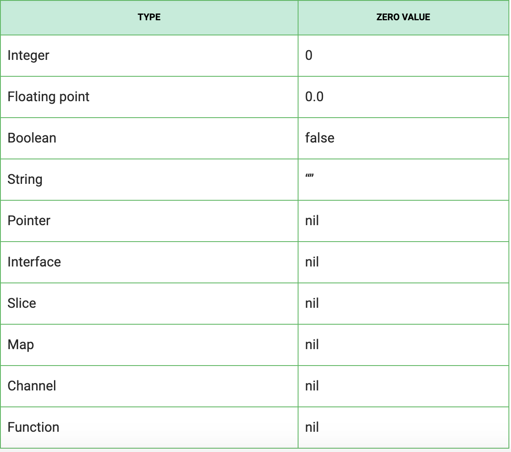
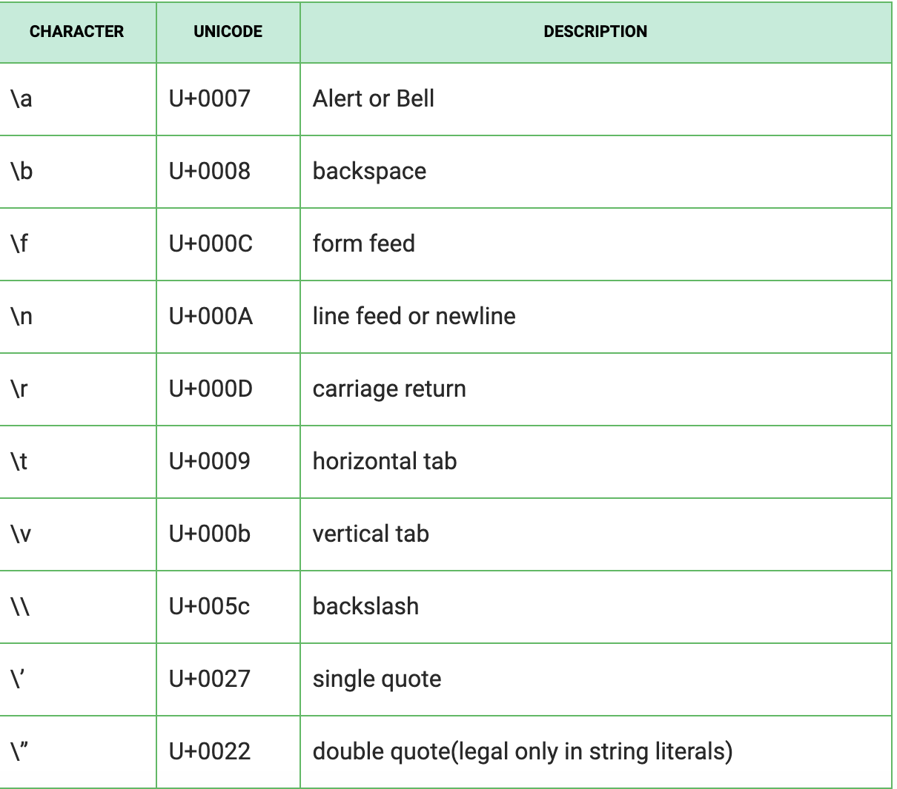
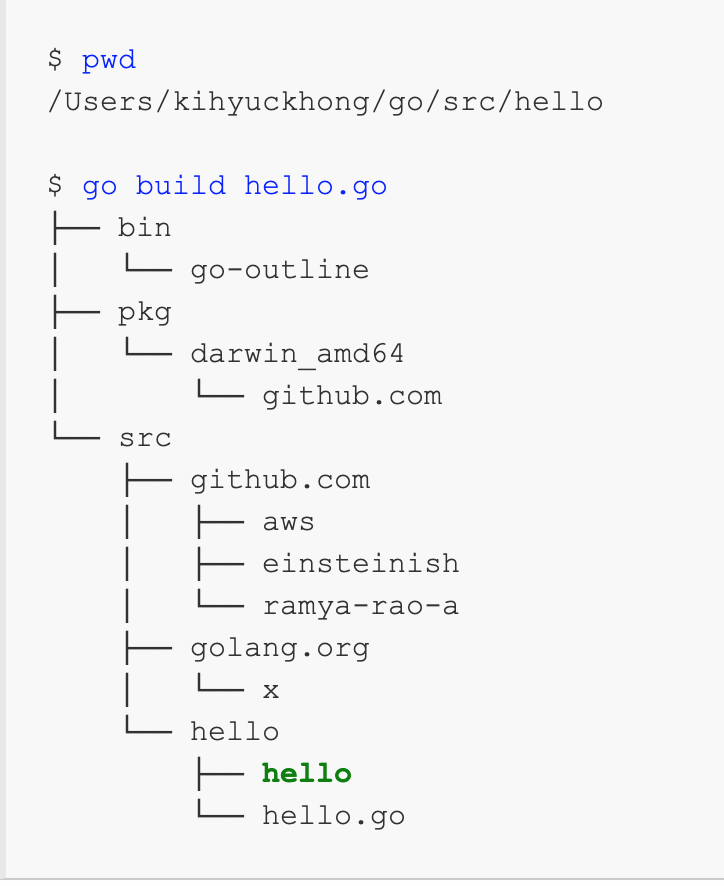
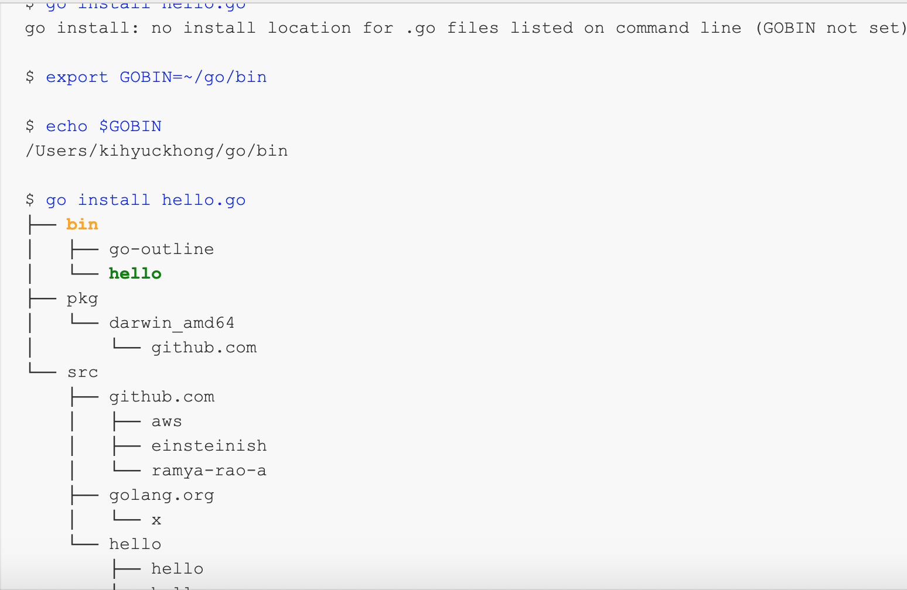

# golang-interview-questions

## References
https://golang.org/

example - https://gobyexample.com/

https://yourbasic.org/golang/

https://www.bogotobogo.com/GoLang/GoLang_Closures_Anonymous_Functions.php

https://www.digitalocean.com/community/tutorial_series/how-to-code-in-go

https://www.golangprograms.com/golang-package-examples.html

https://www.geeksforgeeks.org/golang/

Channels - https://medium.com/rungo/anatomy-of-channels-in-go-concurrency-in-go-1ec336086adb

## Basic
   * year 2007 by Robert Griesemer, Rob Pike, and Ken Thompson
   * go version- 1.14.2
1. ### What is golang?
   * Go is a general-purpose language designed with systems programming in mind. 
   * It is strongly and statically typed, provides inbuilt support for garbage collection and supports concurrent programming. 
   * Programs are constructed using packages, for efficient management of dependencies.
2. ### Benefits of golang
   * support of environment adopting patterns similar to dynamic programming language. for exm- type inference.
   * compilation is fast
   * in built concurrency support
   * inbuilt garbage collection.
   * static type declaration
   * simple,safe reliable.
   * support of interfaces and type embedding.
   * static linking.All the go code can be statically linked into one binary and it can be deployed.
3. ### Is Go a case sensitive language?
   yes
4. ### What is a string literal in Go programming?
   There are two types of string literals:
   - Raw string literals: The value of raw string literals are character sequence between back quotes ". Its value is specified as a string literal that composed of the uninterrupted character between quotes.
   - Interpreted string literals: It is shown between double quotes " ". The value of the literal is specified as text between the double quotes which may not contain newlines.
5. ### What is workspace in Go?
   A workspace contains Go code. A workspace is a directory hierarchy with three directories at its root.

   - "src" directory contains GO source files organized into packages.
   - "pkg" directory contains package objects.
   - "bin" directory contains executable commands
6. ### What is GOPATH environment variable in go programming?
   The GOPATH environment variable specifies the location of the workspace. 
7. ### What are the several built-in supports in Go?
   A list of built-in supports in Go:

   - Container: container/list,container/heap
   - Web Server: net/http
   - Cryptography: Crypto/md5 ,crypto/sha1
   - Compression: compress/gzip
   - Database: database/sql
8. ### What is the usage of break statement in Go programming language?
   The break statement is used to terminate the for loop or switch statement and transfer execution to the statement immediately following the for loop or switch.
9. ### What is the usage of continue statement in Go programming language?
    The continue statement facilitates the loop to skip the remainder of its body and immediately retest its condition prior to reiterating.
10. ### What is the usage of goto statement in Go programming language?
    The goto statement is used to transfer control to the labeled statement.
11. ### How would you print type of variable in Go?
    ```go
      package main

      import (
         "fmt"
      )

      func main(){
         var a = 3   
         fmt.Printf("a is of type %T\n", a)  
      }
    ```
12. ### Is it true that short variable declaration := can be used only inside a function?
    Yes. A short variable declaration := can be used only inside a function.
13. ### How can you format a string without printing?
    You should the following command to format a string without printing:
      ```go
         var a =10
         return fmt.Sprintf ("hi ajay %v" ,a)
      ```
14. ### value printing?
   - This is in Package fmt
   - https://golang.org/pkg/fmt/
   - The default format for %v is:
      ```
         bool:                    %t
         int, int8 etc.:          %d
         uint, uint8 etc.:        %d, %#x if printed with %#v
         float32, complex64, etc: %g
         string:                  %s
         chan:                    %p
         pointer:                 %p
      ```   
   - General:
      ```
         %v	the value in a default format
            when printing structs, the plus flag (%+v) adds field names
         %#v	a Go-syntax representation of the value
         %T	a Go-syntax representation of the type of the value
         %%	a literal percent sign; consumes no value
      ```
   - Boolean:
      ```
         %t	the word true or false
      ```
   - Integer:
      ```
         %b	base 2
         %c	the character represented by the corresponding Unicode code point
         %d	base 10
         %o	base 8
         %O	base 8 with 0o prefix
         %q	a single-quoted character literal safely escaped with Go syntax.
         %x	base 16, with lower-case letters for a-f
         %X	base 16, with upper-case letters for A-F
         %U	Unicode format: U+1234; same as "U+%04X"
      ```
   - Floating-point and complex constituents:
      ```
         %b	decimalless scientific notation with exponent a power of two,
            in the manner of strconv.FormatFloat with the 'b' format,
            e.g. -123456p-78
         %e	scientific notation, e.g. -1.234456e+78
         %E	scientific notation, e.g. -1.234456E+78
         %f	decimal point but no exponent, e.g. 123.456
         %F	synonym for %f
         %g	%e for large exponents, %f otherwise. Precision is discussed below.
         %G	%E for large exponents, %F otherwise
         %x	hexadecimal notation (with decimal power of two exponent), e.g. -0x1.23abcp+20
         %X	upper-case hexadecimal notation, e.g. -0X1.23ABCP+20
      ```
   - String and slice of bytes (treated equivalently with these verbs):
      ```
         %s	the uninterpreted bytes of the string or slice
         %q	a double-quoted string safely escaped with Go syntax
         %x	base 16, lower-case, two characters per byte
         %X	base 16, upper-case, two characters per byte
      ```
   - Slice:
      ```
         %p	address of 0th element in base 16 notation, with leading 0x
      ```
   - Pointer:
      ```
         %p	base 16 notation, with leading 0x
         The %b, %d, %o, %x and %X verbs also work with pointers,
         formatting the value exactly as if it were an integer.
      ```

15. ### Does Go support pointer arithmetics?
    Go programming language doesn't provide support for pointer arithmetic.

16. ### What is Go Interfaces?
    - In GO, interfaces is a way to identify the behavior of an object. An interface is created by using the "type" word, followed by a name and the keyword interface. An interface is specified as two things.
      - A set of methods.
      - Also it is referred as type.
    - Interfaces are types that declare sets of methods. 
    - Similarly to interfaces in other languages, they have no implementation. 
    - Objects that implement all the interface methods automatically implement the interface. 
    - There is no inheritance or subclassing or "implements" keyword.
    - A type implements an interface by implementing its methods. No explicit declaration is required.
    - Implicit interfaces decouple the definition of an interface from its implementation, which could then appear in any package without prearrangement.

17. ### How do I get dynamic dispatch of methods?
    - The only way to have dynamically dispatched methods is through an interface. Methods on a struct or any other concrete type are always resolved statically.
    - Dynamic method dispatch is a mechanism by which a call to an overridden method is resolved at runtime.
18. ### Type, value and equality of interfaces
    - Under the hood, interface values can be thought of as a tuple of a value and a concrete type: `(value, type)`
    - An interface value holds a value of a specific underlying concrete type.
    - Calling a method on an interface value executes the method of the same name on its underlying type.
    ```go
    package main

    import (
    	"fmt"
    	"math"
    )

    type I interface {
    	M()
    }

    type T struct {
    	S string
    }

    func (t *T) M() {
    	fmt.Println(t.S)
    }

    type F float64

    func (f F) M() {
    	fmt.Println(f)
    }

    func main() {
    	var i I

    	i = &T{"Hello"}
    	describe(i)
    	i.M()

    	i = F(math.Pi)
    	describe(i)
    	i.M()
    }

    func describe(i I) {
    	fmt.Printf("(%v, %T)\n", i, i)
    }

    ```
    ```go
    (&{Hello}, *main.T)
    Hello
    (3.141592653589793, main.F)
    3.141592653589793

    ```
    - #### Interface values with nil underlying values
      - If the concrete value inside the interface itself is nil, the method will be called with a nil receiver.
      - In some languages this would trigger a null pointer exception, but in Go it is common to write methods that gracefully handle being called with a nil receiver (as with the method M in this example.)
      - Note that an interface value that holds a nil concrete value is itself non-nil.
      ```go
      package main

      import "fmt"

      type I interface {
      	M()
      }

      type T struct {
      	S string
      }

      func (t *T) M() {
      	if t == nil {
      		fmt.Println("<nil>")
      		return
      	}
      	fmt.Println(t.S)
      }

      func main() {
      	var i I

      	var t *T
      	i = t
      	describe(i)
      	i.M()

      	i = &T{"hello"}
      	describe(i)
      	i.M()
      }

      func describe(i I) {
      	fmt.Printf("(%v, %T)\n", i, i)
      }

      ```
      ```go
      (<nil>, *main.T)
      <nil>
      (&{hello}, *main.T)
      hello
      ```
    - #### Nil interface values
      - A nil interface value holds neither value nor concrete type.
      - Calling a method on a nil interface is a run-time error because there is no type inside the interface tuple to indicate which concrete method to call.
      ```go
      package main

      import "fmt"

      type I interface {
      	M()
      }

      func main() {
      	var i I
      	describe(i)
      	i.M()
      }

      func describe(i I) {
      	fmt.Printf("(%v, %T)\n", i, i)
      }
      ```
      ```go
      (<nil>, <nil>)
      panic: runtime error: invalid memory address or nil pointer dereference
      [signal SIGSEGV: segmentation violation code=0x1 addr=0x0 pc=0x492e3f]

      goroutine 1 [running]:
      main.main()
      	/tmp/sandbox891365133/prog.go:12 +0x8f
      ```
    - #### The empty interface
      - The interface type that specifies no methods is known as the empty interface.
        - `interface{}`
      - An empty interface can hold values of any type since every type implements at least zero methods.
        ```go
        var x interface{}

        x = 2.4
        fmt.Println(x) // 2.4

        x = &Point{1, 2}
        fmt.Println(x) // (1,2)
        ```
      - The fmt.Println function is a chief example. It takes any number of arguments of any type.
        ```go
        func Println(a ...interface{}) (n int, err error)
        ```
    - #### Interface values
      - An interface value consists of a concrete value and a dynamic type: `[Value, Type]`
      - In a call to fmt.Printf, you can use %v to print the concrete value and %T to print the dynamic type.
      - The zero value of an interface type is nil, which is represented as [nil, nil].
      - Calling a method on a nil interface is a run-time error. 
      - You can use type assertions or type switches to access the dynamic type of an interface value. 
    - #### Equality
      - Two interface values are equal
        - if they have equal concrete values and identical dynamic types,
        - or if both are nil.
      - A value t of interface type T and a value x of non-interface type X are equal if
        - t’s concrete value is equal to x
        - and t’s dynamic type is identical to X.
19. ### What is Type assertion in Go? What does it do?
    - A type assertion takes an interface value and retrieves from it a value of the specified explicit type.
    - Type conversion is used to convert dissimilar types in GO.
20. ### Type assertions
    - A type assertion provides access to an interface value's underlying concrete value.
    - `t := i.(T)`
    - This statement asserts that the interface value i holds the concrete type T and assigns the underlying T value to the variable t.
    - If i does not hold a T, the statement will trigger a panic.
    - To test whether an interface value holds a specific type, a type assertion can return two values: the underlying value and a boolean value that reports whether the assertion succeeded.
    - `t, ok := i.(T)`
    - If i holds a T, then t will be the underlying value and ok will be true.
    - If not, ok will be false and t will be the zero value of type T, and no panic occurs.
    ```go
    package main

    import "fmt"

    func main() {
    	var i interface{} = "hello"

    	s := i.(string)
    	fmt.Println(s)

    	s, ok := i.(string)
    	fmt.Println(s, ok)

    	f, ok := i.(float64)
    	fmt.Println(f, ok)

    	f = i.(float64) // panic
    	fmt.Println(f)
    }

    ```
21. ### Type switches
    - A type switch is a construct that permits several type assertions in series.
    - A type switch is like a regular switch statement, but the cases in a type switch specify types (not values), and those values are compared against the type of the value held by the given interface value.
    ```go
    switch v := i.(type) {
    case T:
        // here v has type T
    case S:
        // here v has type S
    default:
        // no match; here v has the same type as i
    }
    ```
    - The declaration in a type switch has the same syntax as a type assertion i.(T), but the specific type T is replaced with the keyword type.
    ```go
    package main

    import "fmt"

    func do(i interface{}) {
    	switch v := i.(type) {
    	case int:
    		fmt.Printf("Twice %v is %v\n", v, v*2)
    	case string:
    		fmt.Printf("%q is %v bytes long\n", v, len(v))
    	default:
    		fmt.Printf("I don't know about type %T!\n", v)
    	}
    }

    func main() {
    	do(21)
    	do("hello")
    	do(true)
    }

    ```
22. ### Stringers
    - One of the most ubiquitous interfaces is Stringer defined by the fmt package.
    ```go
    type Stringer interface {
        String() string
    }
    ```
    - A Stringer is a type that can describe itself as a string. The fmt package (and many others) look for this interface to print values.
    ```go
    package main

    import "fmt"

    type Person struct {
    	Name string
    	Age  int
    }

    func (p Person) String() string {
    	return fmt.Sprintf("%v (%v years)", p.Name, p.Age)
    }

    func main() {
    	a := Person{"Arthur Dent", 42}
    	z := Person{"Zaphod Beeblebrox", 9001}
    	fmt.Println(a, z)
    }
    ```

23. ### What are the different methods in Go programming language?
    - In Go programming language there are several different types of functions called methods. 
    - In method declaration syntax, a "receiver" is used to to represent the container of the function. 
    - This receiver can be used to call function using "." operator.

24. ### What is the default value of a local variable in Go?
    local and global are same.
    int 0
    string empty
    float 0
    bool false
    pointer <nil>

    
    
25. ### How can you check a variable type at runtime in Go programming language?
    In Go programming language, there is a special type of switch dedicated to check variable type at runtime. This switch is referred as `type switch`.
26. ### Is it recommended to use Global Variables in a program that implements go routines?
    Global variables are not recommended because they may get accessed by multiple go routines (threads) concurrently and this can easily lead to an unexpected behavior causing arbitrary results.
27. ### What do you know about modular programming?
    Modular programming is a way to divide the program in to sub programs (modules / function) to achieve maximum efficiency.

    More generic functions definition facilitates you to re-use the functions, such as built-in library functions.
28. ### why golang compilation is fast?
    - The grammar is compact and regular so it is simpler to parse.
    - The language has been designed to be easy to analyze and can be parsed without a symbol table.
    - Each Go file declares its dependencies and it is an error to declare a dependency that is not used, so  computing the dependency tree is efficient.
29. ### symbol table
    - Symbol table is an important data structure created and maintained by compilers in order to store information about the occurrence of various entities such as variable names, function names, objects, classes, interfaces, etc. 
    - Symbol table is used by both the analysis and the synthesis parts of a compiler.
30. ### what is type embedding?
    - If you really want to use inheritance in Go, then type embedding is as close as you can get.
31. ### Type embedding
    - Embedded types are (unnamed) fields, referred to by the unqualified type name.
    - A field declared with a type but no explicit field name is an anonymous field, also called an embedded field or an embedding of the type in the struct.
    - The embedded struct has no access to the embedding struct
      ```go
      type Ball struct {
          Radius   int
          Material string
      }
      ```
      ```go
      type Football struct {
          Ball
          Radius int // it is different from Ball Radius
      }
      ```
    - it is not possible for the embedded struct (child) to access anything from the embedding struct (parent.)
    - It is not possible to typecast to the embedding struct
    - Embedding in interfaces is not possible
    - Embedding interfaces by reference is not possible.
    - Struct types have the ability to contain anonymous or embedded fields. This is also called embedding a type. When we embed a type into a struct, the name of the type acts as the field name for what is then an embedded field.
    - "When we embed a type, the methods of that type become methods of the outer type, but when they are invoked, the receiver of the method is the inner type, not the outer one."
    - Including an anonymous field in a struct is known as embedding. In this case the Discount type is embedded in the PremiumDiscount type. 
      ```go
      type PremiumDiscount struct{
          Discount //Embedded
          additional float32
      }
      ```
      ```go
      type Ball struct {
          Radius   int
          Material string
      }
      ```
      If you want to embed or “inherit” this into a new struct, you can do so as follows:
      ```go
      type Football struct {
          Ball
      }
      ```
      So now you have embedded Ball into Football. Now, if you want instantiate a new football, you can do so as follows:
      ```go
      fb := Football{}
      fmt.Printf("fb = %+v\n", fb)
      ```
      Which outputs:
      ```go
      fb = {Ball:{Radius:0 Material:}}
      ```
      Suppose you want to set the ball parameters of the football, you need to do it like this:
      ```go
      fb := Football{Ball{Radius: 5, Material: "leather"}}
      fmt.Printf("fb = %+v\n", fb)
      ```
      Now if you have this method defined on the embedded type, Ball:
      ```go
      func (b Ball) Bounce() {
          fmt.Printf("Bouncing ball %+v\n", b)
      }
      ```
      You can access the method through the embedding type, Football:
      ```go
      fb.Bounce()
      ```
      If you want to, you can also call this method through the embedding type, which is available as a parameter:
      ```go
      fb.Ball.Bounce()
      ```

    - #### Embedding interfaces
      - If the embedded type implements a particular interface, then that too is accessible through the embedding type. Here is an interface and a function that accepts the interface as parameter:
      ```go
      type Bouncer interface {
          Bounce()
      }
      func BounceIt(b Bouncer) {
          b.Bounce()
      }
      ```
      - Now you can call the method using the embedding type:
      `BounceIt(fb)`
    - #### Embedding pointers
    - So far we have used type embedding on value structs, but it’s also possible to do it by reference, using pointers. In our example, the embedding type would look like this:
      ```go
      type Football struct {
          *Ball
      }
      ```
      ```go
      func (b *Ball) Bounce() {
          fmt.Printf("Bouncing ball %+v\n", b)
      }
      ```
      ```go
      fb := Football{&Ball{Radius: 5, Material: "leather"}}
      fb.Bounce()
      ```
      Which outputs:
      ```go
      Bouncing ball &{Radius:5 Material:leather}
      ```


32. ### What is static type declaration of a variable in Go?
    * Static type variable declaration provides assurance to the compiler that there is one variable existing with the given type and name so that compiler proceed for further compilation without needing complete detail about the variable. A variable declaration has its meaning at the time of compilation only, compiler needs actual variable declaration at the time of linking of the program.
33. ### What is dynamic type declaration of a variable in Go?
    A dynamic type variable declaration requires compiler to interpret the type of variable based on value passed to it. Compiler don't need a variable to have type statically as a necessary requirement.
34. ### What are some advantages of using Go?
    Go is an attempt to introduce a new, concurrent, garbage-collected language with fast compilation and the following benefits:
    * It is possible to compile a large Go program in a few seconds on a single computer.
    * Go provides a model for software construction that makes dependency analysis easy and avoids much of the overhead of C-style include files and libraries.
    * Go's type system has no hierarchy, so no time is spent defining the relationships between types. Also, although Go has static types, the language attempts to make types feel lighter weight than in typical OO languages.
    * Go is fully garbage-collected and provides fundamental support for concurrent execution and communication.
    * By its design, Go proposes an approach for the construction of system software on multicore machines.
35. ### Why the Go language was created?
    Go was born out of frustration with existing languages and environments for systems programming.
    Go is an attempt to have:
    * an interpreted, dynamically typed language with
    * the efficiency and safety of a statically typed, compiled language
    * support for networked and multicore computing
    * be fast in compilation
36. ### Does Go have exceptions?
    No, Go takes a different approach. For plain error handling, Go's multi-value returns make it easy to report an error without overloading the return value. Go code uses error values to indicate an abnormal state.  
37. ### What are Goroutines?
    - Goroutines are functions or methods that run concurrently with other functions or methods.
    - Goroutines can be thought of as light weight threads. 
    - The cost of creating a Goroutine is tiny when compared to a thread.
    - If you want to stop goroutine, you pass a signal channel to the goroutine, that signal channel pushes a  value into when you want the goroutine to stop.
    - The goroutine polls that channel regularly as soon as it detects a signal, it quits.
      ```go
         Quit : = make (chan bool)  
         go func ( ) {  
            for  {  
               select {  
                  case <- quit:  
                     return  
                  default  
                  // do other stuff  
                  }  
               }  
         }()  
         // Do stuff  
         // Quit goroutine  
         Quit <- true  
      ```
38. ### What kind of type conversion is supported by Go?
    - Go is very strict about explicit typing. 
    - There is no automatic type promotion or conversion. 
    - Explicit type conversion is required to assign a variable of one type to another.
39. ### How to efficiently concatenate strings in Go?
    In Go, a string is a primitive type, which means it is read-only, and every manipulation of it will create a new string.
    So if I want to concatenate strings many times without knowing the length of the resulting string, what's the best way to do it?
    Beginning with Go 1.10 there is a strings.Builder. A Builder is used to efficiently build a string using Write methods. It minimizes memory copying. The zero value is ready to use.
      ```go
      package main
      import (
         "strings"
         "fmt"
      )

      func main() {
         var str strings.Builder

         for i := 0; i < 1000; i++ {
            str.WriteString("a")
         }

         fmt.Println(str.String())
      }
      ```
40. ### Is Go an object-oriented language?
    Yes and no. Although Go has types and methods and allows an object-oriented style of programming, `there is no type hierarchy`. This is in contrast to most object-oriented languages like C++, Java, C#, Scala, and even dynamic languages like Python and Ruby.

    Go Object-Oriented Language Features:

    - Structs - Structs are user-defined types. Struct types (with methods) serve similar purposes to classes in other languages.
    - Methods - Methods are functions that operate on particular types. They have a receiver clause that mandates what type they operate on.
    - Embedding - we can embed anonymous types inside each other. If we embed a nameless struct then the embedded struct provides its state (and methods) to the embedding struct directly.
    - Interfaces - 
      - Interfaces are types that declare sets of methods. 
      - Similarly to interfaces in other languages, they have no implementation. 
      - Objects that implement all the interface methods automatically implement the interface. 
      - There is no inheritance or subclassing or "implements" keyword.

    The Go way to implement:

    - Encapsulation - 
    - Go encapsulates things at the package level. 
    - Names that start with a lowercase letter are only visible within that package. 
    - You can hide anything in a private package and just expose specific types, interfaces, and factory functions.
    - Inheritance - composition by embedding an anonymous type is equivalent to implementation inheritance.
    - Polymorphism - A variable of type interface can hold any value which implements the interface. This property of interfaces is used to achieve polymorphism in Go.
    ```go
     package main

     import (  
        "fmt"
     )

     // interface declaration
     type Income interface {  
        calculate() int
        source() string
     }

     // struct declaration
     type FixedBilling struct {  
        projectName string
        biddedAmount int
     }

     type TimeAndMaterial struct {  
        projectName string
        noOfHours  int
        hourlyRate int
     }

     // interface implementation for FixedBilling
     func (fb FixedBilling) calculate() int {  
        return fb.biddedAmount
     }

     func (fb FixedBilling) source() string {  
        return fb.projectName
     }

     // interface implementation for TimeAndMaterial
     func (tm TimeAndMaterial) calculate() int {  
        return tm.noOfHours * tm.hourlyRate
     }

     func (tm TimeAndMaterial) source() string {  
        return tm.projectName
     }

     // using Polymorphism for calculation based 
     // on the array of variables of interface type 
     func calculateNetIncome(ic []Income) {  
        var netincome int = 0
        for _, income := range ic {
           fmt.Printf("Income From %s = $%d\n", income.source(), income.calculate())
           netincome += income.calculate()
        }
        fmt.Printf("Net income of organisation = $%d", netincome)
     }

     func main() {  
        project1 := FixedBilling{projectName: "Project 1", biddedAmount: 5000}
        project2 := FixedBilling{projectName: "Project 2", biddedAmount: 10000}
        project3 := TimeAndMaterial{projectName: "Project 3", noOfHours: 160, hourlyRate: 25}
        incomeStreams := []Income{project1, project2, project3}
        calculateNetIncome(incomeStreams)
     }
    ```
41. ### what is the difference between a function and a method?
    - A method is a function that has a defined receiver, in OOP terms, a method is a function on an instance of an object.
    - Go does not have classes. However, you can define methods on struct types.
    - The method receiver appears in its own argument list between the func keyword and the method name.
42. ### What's Codepoint
    - Unicode gives each character a integer id. This integer id is called codepoint.
    - Note, not all codepoint are character as we think of. For example, space, newline, tab, right-to-left mark, combining character accents, are all codepoints.
43. ### What is "rune" type in Go?
    - ASCII - American Standard Code for Information Interchange
    - In the past, we only deal with one character set that is known as ASCII or the American Standard Code for Information Interchange. Here we use 7 bits to represent 128 characters, including upper and lowercase English letters, digits, and a variety of punctuations and device-control characters. Due to this a large number of the population of the world is not able to use their own writing system on the computer. So to solve this problem Unicode is invented. It is a superset of ASCII and contains all the characters present in the world’s writing system including accents and other diacritical marks, control codes like tab and carriage return, and assigns each one a standard number called a Unicode code point, or in Go language, a rune. The rune type is an alias of int32.
    - Always remember a string is a sequence of bytes not of a rune. But it is possible that a string may contain Unicode text encoded in UTF-8 and as we knew that the go source code in always encodes as UTF-8 so, there is no need to encode the string in UTF-8.
    - UTF-8 encodes all the Unicode in between 1 to 4 bytes, where 1 byte is used for ASCII and rest used for the rune.
    - ASCII contains total 256 elements. In which 128 are characters and 0-127 are identified as code points. Here code point refers to the element which represents a single value.
    - A rune is a builtin type in Go and it's the alias of int32. 
    - “Rune” means Unicode codepoint. (think of it as a character.)
    - rune represents a Unicode CodePoint in Go. 
    - It does not matter how many bytes the code point occupies, it can be represented by a rune. For example the rule literal `a` is in reality the number 97.
    - however they're untyped constants, so their type can change
    - When you see the word “rune”, you can think of it as any or all of the following:
        - A integer. (possible values are from 0 to 2^32-1, but not all are valid unicode codepoint.)
        - A golang type, with keyword rune. It is alias to the type int32
        - A unicode codepoint.
        - A character.
    ```go
     package main

     import "fmt"

     func SwapRune(r rune) rune {
        switch {
        case 97 <= r && r <= 122:
           return r - 32
        case 65 <= r && r <= 90:
           return r + 32
        default:
           return r
        }
     }

     func main() {
        fmt.Println(SwapRune('a'))
     }
    ```

    - A string is not necessarily a sequence of runes. We can convert between string and []rune, but they are different.
    - #### Rune Literal
    - It represents a rune constant where an integer value recognizes a Unicode code point. 
    - In Go language, rune literal expressed as one or more characters enclosed in single quotes like ‘g’, ‘\t’, etc. in between single quotes you are allowed place any character except a newline and an unescaped single quote. 
    - Here, these single-quoted characters itself represent the Unicode value of the given character and multi-character sequences with a backslash( at the beginning of the multi-character sequence) encodes values in a different format. In rune literals, all the sequences start with a backslash are illegal, only the following single-character escapes represent special values when you use them with a backslash:

    

44. ### What is so special about constants in Go?
    - Untyped constants - 
      - Any constant in golang, named or unnamed, is untyped unless given a type explicitly. 
      - For example an untyped floating-point constant like 4.5 can be used anywhere a floating-point value is allowed.
      - We can use untyped constants to temporarily escape from Go’s strong type system until their evaluation in a type-demanding expression.

    - Typed constants 
      - Constants are typed when you explicitly specify the type in the declaration. 
      - With typed constants, you lose all the flexibility that comes with untyped constants like assigning them to any variable of compatible type or mixing them in mathematical operations.
45. ### How to initialise a struct in Go?
    The new keyword can be used to create a new struct. It returns a pointer to the newly created struct.
    ```go
      var pa *Student   // pa == nil
      pa = new(Student) // pa == &Student{"", 0}
      pa.Name = "Alice" // pa == &Student{"Alice", 0}
    ```

    You can also create and initialize a struct with a struct literal.
    ```go
      b := Student{ // b == Student{"Bob", 0}
         Name: "Bob",
      }

      pb := &Student{ // pb == &Student{"Bob", 8}
         Name: "Bob",
         Age:  8,
      }

      c := Student{"Cecilia", 5} // c == Student{"Cecilia", 5}
      d := Student{}             // d == Student{"", 0}
    ```
46. ### How to check if a map contains a key in Go?
    ```go
     if val, ok := dict["foo"]; ok {
        //do something here
     }
    ```
    if statements in Go can include both a condition and an initialization statement. The example above uses both:

    initializes two variables - val will receive either the value of "foo" from the map or a "zero value" (in this case the empty string) and ok will receive a bool that will be set to true if "foo" was actually present in the map

    evaluates ok, which will be true if "foo" was in the map

    If "foo" is indeed present in the map, the body of the if statement will be executed and val will be local to that scope.
  
47. ### Can Go have optional parameters?
    - Go does not have optional parameters nor does it support method overloading:
    - Method dispatch is simplified if it doesn't need to do type matching as well.
48. ### What is the difference between the = and := operator?
    In Go, := is for declaration + assignment, whereas = is for assignment only.
    For example, var foo int = 10 is the same as foo := 10.
49. ### Data Type
    byte = uint8
    rune = int32
    uint, int
50. lvalue Expressions that refer to a memory location is called "lvalue" expression.
51. rvalue − The term rvalue refers to a data value that is stored at some address in memory. 
52. ### Range
    The range keyword is used in for loop to iterate over items of an array, slice, channel or map.
    With array and slices, it returns the index of the item as integer. With maps, it returns the key of the next key-value pair. Range either returns one value or two. If only one value is used on the left of a range expression, it is the 1st value in the following table.
53. ### Why goroutine not thread?
    goroutine has many benefits over thread.
    - goroutine is builtin primitive in golang.
    - goroutine allows to avoid resort mutex locking when sharing data structure because go mantra is
      `do not communicate by sharing memory, share memory by communicating.`
    - biggest drawback of thread programming is complexity and brittleness of memory code bases that uses  thread to achieve high concurrency.There can be latent deadlock and race condition and it can become near imposible to reason about the code.
    - go gives a primitives to avoid locking completely by using channel. if two goroutine want to share some data, it can use channel and go handles all the synchronization for you. It much harder to run into condition like deadlock.
    - goroutine is light weight and thread is heavy relatively. Because of large stack size.
    - you can run more goroutine than thread in a system.
    - thread is directly mapped with os thread but goroutine is multiplexed over small number of os thread rather than 1:1 mapping.
    - goroutine has faster startup time.
    - goroutine has growable segmented stack.
    - in java , you can run 1000's pf thread pr 10's of 1000's of thread but in go you can run milions of go routines.
    - go OTOH(On the Other Hand) has segmentated stack which can grow as needed.
      - It is called green thread.
      - Beacuse go runtime does the scheduling not the os. 
      - Goroutines are multiplexed over os thread and the numbers are controlled by `GOMAXPROCS` to maximize potential parallelism.
    - A goroutine is a lightweight thread managed by the Go runtime.
      ```go
      go f(x, y, z)
      ```
      starts a new goroutine running
      ```go
      f(x, y, z)
      ```
      The evaluation of `f, x, y, and z` happens in the current goroutine and the execution of `f` happens in the new goroutine.

      - Goroutines run in the same address space, so access to shared memory must be synchronized.
      - The sync package provides useful primitives, although you won't need them much in Go as there are other primitives.
      ```go
         package main

         import (
            "fmt"
            "time"
         )

         func say(s string) {
            for i := 0; i < 5; i++ {
               time.Sleep(100 * time.Millisecond)
               fmt.Println(s)
            }
         }

         func main() {
            go say("world")
            say("hello")
         }
      ```
54. ### Channels are a typed conduit through which you can send and receive values with the channel operator,  <-.
    ```go
      ch <- v    // Send v to channel ch.
      v := <-ch  // Receive from ch, and
           // assign value to v.
    ```
    (The data flows in the direction of the arrow.)
    Like maps and slices, channels must be created before use:
    ```go
    ch := make(chan int)
    ```
    - By default, sends and receives block until the other side is ready. This allows goroutines to synchronize without explicit locks or condition variables.
    - `<- c` means we want to read some data from channel c. This statement does not push data into anything, but still, it’s a valid statement.
    - If you are trying to read data from a channel but channel does not have a value available with it, it blocks the current goroutine and unblocks other in a hope that some goroutine will push a value to the channel. Hence, this read operation will be blocking. 
    - Similarly, if you are to send data to a channel, it will block current goroutine and unblock others until some goroutine reads the data from it. Hence, this send operation will be blocking.
    - An infinite syntax for loop for{} can be used to read multiple values sent through a channel.
55. ### Channels can be buffered. Provide the buffer length as the second argument to make to initialize a   buffered channel:
    ```go
      ch := make(chan int, 100)
    ```
    - Sends to a buffered channel block only when the buffer is full. 
    - Receives block when the buffer is empty.
    ```go
         package main

         import "fmt"

         func main() {
            ch := make(chan int, 2)
            ch <- 1
            ch <- 2
            fmt.Println(<-ch)
            fmt.Println(<-ch)
         }
    ```
56. ### Channel Directions
    - When using channels as function parameters, you can specify if a channel is meant to only send or receive values. 
    - This specificity increases the type-safety of the program.
    - This ping function only accepts a channel for sending values. It would be a compile-time error to try to receive on this channel.
    - The pong function accepts one channel for receives (pings) and a second for sends (pongs).
      ```go
      package main

      import "fmt"

      func ping(pings chan<- string, msg string) {
          pings <- msg
      }

      func pong(pings <-chan string, pongs chan<- string) {
          msg := <-pings
          pongs <- msg
      }

      func main() {
          pings := make(chan string, 1)
          pongs := make(chan string, 1)
          ping(pings, "passed message")
          pong(pings, pongs)
          fmt.Println(<-pongs)
      }
      ```

57. ### Range and close
    - A sender can close a channel to indicate that no more values will be sent. 
    - Receivers can test whether a channel has been closed by assigning a second parameter to the receive   expression: after
    ```go
      v, ok := <-ch
    ```
    ok is false if there are no more values to receive and the channel is closed.

    - The loop for `i := range c` receives values from the channel repeatedly until it is closed.

    Note: Only the sender should close a channel, never the receiver. Sending on a closed channel will cause a panic.

    #### Another note: 
    Channels aren't like files; you don't usually need to close them. Closing is only necessary when the receiver must be told there are no more values coming, such as to terminate a range loop.
58. ### select
    - The `select` statement lets a goroutine wait on multiple communication operations.

    - A `select` blocks until one of its cases can run, then it executes that case. It chooses one at random if multiple are ready.
    ```go
    package main

      import "fmt"

      func fibonacci(c, quit chan int) {
         x, y := 0, 1
         for {
            select {
            case c <- x:
               x, y = y, x+y
            case <-quit:
               fmt.Println("quit")
               return
            }
         }
      }

      func main() {
         c := make(chan int)
         quit := make(chan int)
         go func() {
            for i := 0; i < 10; i++ {
               fmt.Println(<-c)
            }
            quit <- 0
         }()
         fibonacci(c, quit)
      }

    ```
    - 2nd exm
    ```go
    package main

    import (
        "fmt"
        "time"
    )

    func main() {

        c1 := make(chan string)
        c2 := make(chan string)

        go func() {
            time.Sleep(1 * time.Second)
            c1 <- "one"
        }()
        go func() {
            time.Sleep(2 * time.Second)
            c2 <- "two"
        }()

        for i := 0; i < 2; i++ {
            select {
            case msg1 := <-c1:
                fmt.Println("received", msg1)
            case msg2 := <-c2:
                fmt.Println("received", msg2)
            }
        }
    }
    ```
    - ### Default select
     - The default case in select is run when no other case is ready
     - Use a default case to try a send or receive without blocking:
    ```go
      select {
      case i := <-c:
         // use i
      default:
         // receiving from c would block
         fmt.Println(" .")
    time.Sleep(50 * time.Millisecond)
      }
    ```
59. ### Once
    - The sync package provides a safe mechanism for initialization in the presence of multiple goroutines through the use of the Once type. Multiple threads can execute once.Do(f) for a particular f, but only one will run f(), and the other calls block until f() has returned.

    A single call of f() from once.Do(f) happens (returns) before any call of once.Do(f) returns.
60. ### sync.Mutex 
    We've seen how channels are great for communication among goroutines.

    But what if we don't need communication? What if we just want to make sure only one goroutine can access a variable at a time to avoid conflicts?

    This concept is called mutual exclusion, and the conventional name for the data structure that provides it is mutex.

    Go's standard library provides mutual exclusion with sync.Mutex and its two methods:

    `Lock`
    `Unlock`
    We can define a block of code to be executed in mutual exclusion by surrounding it with a call to Lock and Unlock as shown on the Inc method.

    We can also use defer to ensure the mutex will be unlocked as in the Value method.

    ```go
     package main

     import (
        "fmt"
        "sync"
        "time"
     )

     // SafeCounter is safe to use concurrently.
     type SafeCounter struct {
        v   map[string]int
        mux sync.Mutex		
     }

     // Inc increments the counter for the given key.
     func (c *SafeCounter) Inc(key string) {
        c.mux.Lock()
        // Lock so only one goroutine at a time can access the map c.v.
        c.v[key]++
        c.mux.Unlock()
     }

     // Value returns the current value of the counter for the given key.
     func (c *SafeCounter) Value(key string) int {
        c.mux.Lock()
        // Lock so only one goroutine at a time can access the map c.v.
        defer c.mux.Unlock()
        return c.v[key]
     }

     func main() {
        c := SafeCounter{v: make(map[string]int)}
        for i := 0; i < 1000; i++ {
           go c.Inc("somekey")
        }

        time.Sleep(time.Second)
        fmt.Println(c.Value("somekey"))
     }

    ```
61. ### Does Go have a runtime?
    - Go does have an extensive library, called the runtime, that is part of every Go program.
    - The runtime library implements garbage collection, concurrency, stack management, and other critical features of the Go language.
62. ### Why does Go not have exceptions?
    - We believe that coupling exceptions to a control structure, as in the `try-catch-finally` idiom, results in convoluted code. 
    - It also tends to encourage programmers to label too many ordinary errors, such as failing to open a file, as exceptional.
    - Go takes a different approach. For plain error handling, Go's multi-value returns make it easy to report an error without overloading the return value.
    - A canonical error type, coupled with Go's other features, makes error handling pleasant but quite different from that in other languages.
    - Go also has a couple of built-in functions to signal and recover from truly exceptional conditions. Defer, Panic, and Recover
    
63. ### Why is there no type inheritance?
    - Rather than requiring the programmer to declare ahead of time that two types are related, in Go a type automatically satisfies any interface that specifies a subset of its methods. 
    - Types can satisfy many interfaces at once, without the complexities of traditional multiple inheritance.
    - Interfaces can be very lightweight—an interface with one or even zero methods can express a useful concept.
    - Interfaces can be added after the fact if a new idea comes along or for testing—without annotating the original types. 
    - Because there are no explicit relationships between types and interfaces, there is no type hierarchy to manage or discuss.
64. ### Why does Go not support overloading of methods and operators?
    - Method dispatch is simplified if it doesn't need to do type matching as well.
    - Experience with other languages told us that having a variety of methods with the same name but different signatures was occasionally useful but that it could also be confusing and fragile in practice.
    - Matching only by name and requiring consistency in the types was a major simplifying decision in Go's type system.
    - Regarding operator overloading, it seems more a convenience than an absolute requirement. Again, things are simpler without it.
65. ### Why doesn't Go have "implements" declarations?
    - A Go type satisfies an interface by implementing the methods of that interface, nothing more.
    - This property allows interfaces to be defined and used without needing to modify existing code.
    - It enables a kind of structural typing that promotes separation of concerns and improves code re-use, and makes it easier to build on patterns that emerge as the code develops.
66. ### How can I guarantee my type satisfies an interface?
    - You can ask the compiler to check that the type T implements the interface I by attempting an assignment using the zero value for T or pointer to T, as appropriate:
    ```go
      type T struct{}
      var _ I = T{}       // Verify that T implements I.
      var _ I = (*T)(nil) // Verify that *T implements I.
    ```
67. ### Can I convert a []T to an []interface{}?
    - Not directly. It is disallowed by the language specification because the two types do not have the same representation in memory. It is necessary to copy the elements individually to the destination slice. This example converts a slice of int to a slice of interface{}:
    ```go
    t := []int{1, 2, 3, 4}
    s := make([]interface{}, len(t))
    for i, v := range t {
      s[i] = v
    }
    ```
68. ### Why does Go not provide implicit numeric conversions? 
    - The convenience of automatic conversion between numeric types in C is outweighed by the confusion it causes. 
      - When is an expression unsigned? 
      - How big is the value? 
      - Does it overflow? 
      - Is the result portable, independent of the machine on which it executes?
      - It also complicates the compiler; “the usual arithmetic conversions” are not easy to implement and inconsistent across architectures. 
    - For reasons of portability, we decided to make things clear and straightforward at the cost of some explicit conversions in the code. 
69. ### Why don't maps allow slices as keys?
    - Map lookup requires an equality operator, which slices do not implement. 
    - They don't implement equality because equality is not well defined on such types; 
    - there are multiple considerations involving shallow vs. deep comparison, pointer vs. value   comparison, how to deal with recursive types, and so on.
70. ### What's the difference between new and make?
    - In short: new allocates memory, while make initializes the slice, map, and channel types.
71. ### What is the size of an int on a 64 bit machine?
    The sizes of int and uint are implementation-specific but the same as each other on a given platform. For portability, code that relies on a particular size of value should use an explicitly sized type, like int64. On 32-bit machines the compilers use 32-bit integers by default, while on 64-bit machines integers have 64 bits. (Historically, this was not always true.)
72. ### How do I know whether a variable is allocated on the heap or the stack? 
    - From a correctness standpoint, you don't need to know. Each variable in Go exists as long as there are references to it. The storage location chosen by the implementation is irrelevant to the semantics of the language.
    - When possible, the Go compilers will allocate variables that are local to a function in that function's stack frame. However, if the compiler cannot prove that the variable is not referenced after the function returns, then the compiler must allocate the variable on the garbage-collected heap to avoid dangling pointer errors. Also, if a local variable is very large, it might make more sense to store it on the heap rather than the stack.
73. ### Why does my Go process use so much virtual memory?
    - The Go memory allocator reserves a large region of virtual memory as an arena for allocations. This virtual memory is local to the specific Go process; the reservation does not deprive other processes of memory.

      To find the amount of actual memory allocated to a Go process, use the Unix top command and consult the RES (Linux) or RSIZE (macOS) columns.

74. ### Defer
    - Golang has few statements to run code in a seperate goroutine. ie. defer, panic,recover
    - defer statement pushes a function call onto a list.
    - The list of saved calls is executed after the surrounding function returns.
    - defer is commonly used to simplify functions that performs variuos clean-up actions
    - exm  file closing.
    - There are three simple rules:
      - A deferred function's arguments are evaluated when the defer statement is evaluated.
        In this example, the expression "i" is evaluated when the Println call is deferred. The deferred call will print "0" after the function returns.
        ```go
        func a() {
          i := 0
          defer fmt.Println(i)
          i++
          return
        }
         ```
      - Deferred function calls are executed in Last In First Out order after the surrounding function returns.
        This function prints "3210":
        ```go
        func b() {
            for i := 0; i < 4; i++ {
                defer fmt.Print(i)
            }
        }
        ```
      - Deferred functions may read and assign to the returning function's named return values.
        In this example, a deferred function increments the return value i after the surrounding function returns. Thus, this function returns 2:
        ```go
        func c() (i int) {
            defer func() { i++ }()
            return 1
        }
        ```

75. ### explain panic
    - A panic typically means something went unexpectedly wrong. 
    - Panic is a built-in function that stops the ordinary flow of control and begins panicking. 
    - When the function F calls panic, execution of F stops, any deferred functions in F are executed normally, and then F returns to its caller. To the caller, F then behaves like a call to panic.
    - The process continues up the stack until all functions in the current goroutine have returned, at which point the program crashes.
    - exm out-of-bounds array access
    ```go
    package main

    import "os"

    func main() {

        panic("a problem")

        _, err := os.Create("/tmp/file")
        if err != nil {
            panic(err)
        }
    }
    ```
76. ### explain recover 
    - Recover is a built-in function that regains control of a panicking goroutine.
    - Recover is only useful inside deferred functions. 
    - During normal execution, a call to recover will return nil and have no other effect. 
    - If the current goroutine is panicking, a call to recover will capture the value given to panic and resume normal execution.
77. ### Here's an example program that demonstrates the mechanics of panic and defer:
    ```go
    package main

    import "fmt"

    func main() {
        f()
        fmt.Println("Returned normally from f.")
    }

    func f() {
        defer func() {
            if r := recover(); r != nil {
                fmt.Println("Recovered in f", r)
            }
        }()
        fmt.Println("Calling g.")
        g(0)
        fmt.Println("Returned normally from g.")
    }

    func g(i int) {
        if i > 3 {
            fmt.Println("Panicking!")
            panic(fmt.Sprintf("%v", i))
        }
        defer fmt.Println("Defer in g", i)
        fmt.Println("Printing in g", i)
        g(i + 1)
    }
    ```
78. ### example of panic and recover
    1. `encoding/json`
79. ### slice
    -  slice represents a flexible-length array-like data type while providing full control over memory allocations
    -  A slice is just a view on an array
    -  Slices add a dynamic layer on top of arrays. 
    -  Creating a slice from an array neither allocates new memory nor copies anything. 
    -  A slice is nothing but a “window” to some part of the array. 
    -  Technically, a slice can be seen as a struct with a pointer to the array element where the slice starts, and two ints describing length and capacity.
    -  The data location does not change.
    -  This also means that two slices created from the same array can overlap, and after assigning a slice to a new slice variable, both variables now share the same memory cells.
    -  Changing one item in one of the slices also change the same item in the other slice. 
    -  If you want to create a true copy of a slice, create a new slice and use the built-in function copy().
    -  ### append()
       - append() adds new elements to the end of a slice, thus expanding the slice. 
       - append() has two convenience features:
         - First, it can append to a nil slice, making it spring into existence in the moment of appending
         - Second, if the remaining capacity is not sufficient for appending new values, append() automatically takes care of allocating a new array and copying the old content over.
         - sometimes the original array has been changed, and sometimes a new array has been created, and the original one stays the same. If the original array was referenced by different parts of the code, one reference then may point to stale data.
80. ### Arrays
    - Arrays are fixed-length sequences of items of the same type. 
    - assigning one array to another copies all of the elements
    - if you pass an array to a function, it will receive a copy of the array (not a pointer or reference to it).
    - this can be very expensive, especially when you are working with arrays that have a large number of elements.
    - Arrays in Go can be created using the following syntaxes:
      ```
         [N]Type
         [N]Type{value1, value2, ..., valueN}
         [...]Type{value1, value2, ..., valueN}
      ```
81. ### Arrays vs slices
    - Slices, on the other hand, are much more flexible, powerful, and convenient than arrays. 
    - Unlike arrays, slices can be resized using the built-in append function. 
    - Further, slices are reference types, meaning that they are cheap to assign and can be passed to other functions without having to create a new copy of its underlying array. 
    - Lastly, the functions in Go’s standard library all use slices rather than arrays in their public APIs.

    Slices can be created using the following syntaxes:

    make([]Type, length, capacity)
    make([]Type, length)
    []Type{}
    []Type{value1, value2, ..., valueN}
    Overall, slices are cleaner, more flexible, and less bug-prone than arrays, so you should prefer using them over arrays whenever possible.
82. ### new() vs make()
    - The builtin new(T) function allocates “zeroed” storage for a new item of type T and returns its address, a value of type *T. 
    - In Go terminology, it returns a pointer to a newly allocated zero value of type T.
    - For example, here are three different ways to create a pointer p that points to a zeroed bytes.Buffer value, each of which are equivalent:
    ```go
    // Allocate enough memory to store a bytes.Buffer value
    // and return a pointer to the value's address.
    var buf bytes.Buffer
    p := &buf

    // Use a composite literal to perform allocation and
    // return a pointer to the value's address.
    p := &bytes.Buffer{}

    // Use the new function to perform allocation, which will
    // return a pointer to the value's address.
    p := new(bytes.Buffer)
    ```
    - ### make()
    - The make() function, is a special built-in function that is used to initialize slices, maps, and channels. 
    - Note that make() can only be used to initialize slices, maps, and channels,
    - and that, unlike the new() function, make() does not return a pointer.

    - Slices, maps, and channels can also be initialized using a composite literal expressions, as well as with make(). 
    - Two different (yet equivalent) ways to initialize a map m which maps string keys to bool values are given below as examples:
    ```go
    // Using make() to initialize a map.
    m := make(map[string]bool, 0)

    // Using a composite literal to initialize a map.
    m := map[string]bool{}
    You can also initialize maps with initial data using a composite literal, as shown below:

    m := map[string]bool{
        "java": false,
        "go":   true,
    }
    ```
83. ### HTTP Servers
    - A fundamental concept in net/http servers is handlers. 
    - A handler is an object implementing the http.Handler interface. 
    - A common way to write a handler is by using the `http.HandlerFunc` adapter on functions with the appropriate signature.
    - Functions serving as handlers take a http.ResponseWriter and a http.Request as arguments. 
    - The response writer is used to fill in the HTTP response. 
    - Here our simple response is just “hello\n”.
    - We register our handlers on server routes using the http.HandleFunc convenience function. 
    - It sets up the default router in the net/http package and takes a function as an argument.
    #### server
    ```go
    package main

    import (
        "fmt"
        "net/http"
    )

    func hello(w http.ResponseWriter, req *http.Request) {

        fmt.Fprintf(w, "hello\n")
    }

    func headers(w http.ResponseWriter, req *http.Request) {

        for name, headers := range req.Header {
            for _, h := range headers {
                fmt.Fprintf(w, "%v: %v\n", name, h)
            }
        }
    }

    func main() {

        http.HandleFunc("/hello", hello)
        http.HandleFunc("/headers", headers)

        http.ListenAndServe(":8090", nil)
    }
    ```
    #### client
    ```go
    package main

    import (
        "bufio"
        "fmt"
        "net/http"
    )

    func main() {

        resp, err := http.Get("http://gobyexample.com")
        if err != nil {
            panic(err)
        }
        defer resp.Body.Close()

        fmt.Println("Response status:", resp.Status)

        scanner := bufio.NewScanner(resp.Body)
        for i := 0; scanner.Scan() && i < 5; i++ {
            fmt.Println(scanner.Text())
        }

        if err := scanner.Err(); err != nil {
            panic(err)
        }
    }
    ```
84. ### signals
    - Sometimes we’d like our Go programs to intelligently handle Unix signals.
    - For example, we might want a server to gracefully shutdown when it receives a SIGTERM, or a command-line tool to stop processing input if it receives a SIGINT. 
    - How?
      - Go signal notification works by sending os.Signal values on a channel. 
      - We’ll create a channel to receive these notifications (we’ll also make one to notify us when the program can exit).
      - signal.Notify registers the given channel to receive notifications of the specified signals.
      - This goroutine executes a blocking receive for signals. 
      - When it gets one it’ll print it out and then notify the program that it can finish.
      - The program will wait here until it gets the expected signal (as indicated by the goroutine above sending a value on done) and then exit.
      - When we run this program it will block waiting for a signal. By typing ctrl-C (which the terminal shows as ^C) we can send a SIGINT signal, causing the program to print interrupt and then exit.
      ```go
      package main

      import (
          "fmt"
          "os"
          "os/signal"
          "syscall"
      )

      func main() {

          sigs := make(chan os.Signal, 1)
          done := make(chan bool, 1)

          signal.Notify(sigs, syscall.SIGINT, syscall.SIGTERM)

          go func() {
              sig := <-sigs
              fmt.Println()
              fmt.Println(sig)
              done <- true
          }()

          fmt.Println("awaiting signal")
          <-done
          fmt.Println("exiting")
      }
      ```  


85. ### Context
    - HTTP servers are useful for demonstrating the usage of context.Context for controlling cancellation. 
    - A Context carries deadlines, cancellation signals, and other request-scoped values across API boundaries and goroutines.
    - A context.Context is created for each request by the net/http machinery, and is available with the Context() method.
    - Wait for a few seconds before sending a reply to the client. This could simulate some work the server is doing. While working, keep an eye on the context’s Done() channel for a signal that we should cancel the work and return as soon as possible.
    - The context’s Err() method returns an error that explains why the Done() channel was closed.
    - Simulate a client request to /hello, hitting Ctrl+C shortly after starting to signal cancellation.
    - Do not store Contexts inside a struct type; instead, pass a Context explicitly to each function that needs it. The Context should be the first parameter, typically named ctx:
      ```go
      func DoSomething(ctx context.Context, arg Arg) error {
      	// ... use ctx ...
      }
      ```
    - Do not pass a nil Context, even if a function permits it. Pass context.TODO if you are unsure about which Context to use.
    - Use context Values only for request-scoped data that transits processes and APIs, not for passing optional parameters to functions.
    - The WithCancel, WithDeadline, and WithTimeout functions take a Context (the parent) and return a derived Context (the child) and a CancelFunc. 
    - Calling the CancelFunc cancels the child and its children, removes the parent's reference to the child, and stops any associated timers. 
    - Failing to call the CancelFunc leaks the child and its children until the parent is canceled or the timer fires. 
    - The go vet tool checks that CancelFuncs are used on all control-flow paths.
    ```go
    package main

    import (
        "fmt"
        "net/http"
        "time"
    )

    func hello(w http.ResponseWriter, req *http.Request) {

        ctx := req.Context()
        fmt.Println("server: hello handler started")
        defer fmt.Println("server: hello handler ended")

        select {
        case <-time.After(10 * time.Second):
            fmt.Fprintf(w, "hello\n")
        case <-ctx.Done():

            err := ctx.Err()
            fmt.Println("server:", err)
            internalError := http.StatusInternalServerError
            http.Error(w, err.Error(), internalError)
        }
    }

    func main() {

        http.HandleFunc("/hello", hello)
        http.ListenAndServe(":8090", nil)
    }
    ```
86. ### Read file
    - https://www.educative.io/edpresso/file-reading-in-golang
    - #### Reading an entire file into memory
      ```go
      package main
      import (
        "fmt"
        "io/ioutil"
      )

      func main() {
        data, err := ioutil.ReadFile("file.txt")
        if err != nil {
          fmt.Println("File reading error", err)
          return
        }
        fmt.Println("Contents of file:")
        fmt.Println(string(data))
      }
      ```
    - #### Reading file in bytes
      ```go
      package main


      import (
      	"fmt"
      	"os"
      )


      func main(){
      	f,err := os.Open("mine/golang/src/a.txt")
      	if err!=nil{
      		fmt.Println("err",err)
      	}
      	b1:=make([]byte,5)
      	for{
      		n1,err := f.Read(b1)
      		if err!= nil{
      			break
      		}
      		fmt.Printf("%v",string(b1[:n1]))
      	}
      	

      }
      ```
    - #### Reading a file line by line
      ```go
      package main


      import (
      	"fmt"
      	"os"
      	"bufio"
      )


      func main(){
      	f,err := os.Open("mine/golang/src/a.txt")
      	if err!=nil{
      		fmt.Println("err",err)
      	}
      	s := bufio.NewScanner(f)
      	for s.Scan(){
      		fmt.Println(s.Text())
      	}
      	
      	

      }
      ```

87. ### Write file
    - #### Writing string to a file
      ```go
      package main

      import (
      	"fmt"
      	"os"
      )

      func main(){
      	f, err:= os.Create("mine/golang/src/b.txt")
      	if err != nil {
      		fmt.Println("err",err)
      		return
      	}
      	l,err:= f.WriteString("hi riya")
      	if err != nil {
      		fmt.Println(err)
      	}
      	fmt.Println(l,"written successfully")
      	f.Close()


      }
      ```
    - #### Writing bytes to a file
      ```go
      package main

      import (
      	"fmt"
      	"os"
      )

      func main(){
      	f, err:= os.Create("mine/golang/src/b.txt")
      	if err != nil {
      		fmt.Println("err",err)
      		return
      	}
      	b:= []byte{104, 101, 108, 108, 111, 32, 119, 111, 114, 108, 100}
      	n,err := f.Write(b)
      	if err!= nil {
      		fmt.Println("err",err)
      	}
      	fmt.Println(n,"writes to file")
      	f.Close()


      }
      ```
    - #### Writing strings line by line to a file
      ```go
      package main

      import (
      	"fmt"
      	"os"
      )

      func main(){
      	f, err:= os.Create("mine/golang/src/b.txt")
      	if err != nil {
      		fmt.Println("err",err)
      		return
      	}
      	s := []string{"hello","world"}
      	for _,v := range s{
      		fmt.Fprintln(f,v)
      	}
      	f.Close()


      }
      ```

    - #### Appending to a file
      ```go
      package main

      import (
      	"fmt"
      	"os"
      )

      func main(){
      	f, err:= os.OpenFile("mine/golang/src/b.txt",os.O_APPEND|os.O_WRONLY,0644)
      	if err != nil {
      		fmt.Println("err",err)
      		return
      	}
      	s := "IT IS NEW LINE"
      	fmt.Fprintln(f,s)
      	f.Close()


      }
      ```
    - ### 
    ```go
    package main

    import (
        "bufio"
        "fmt"
        "io/ioutil"
        "os"
    )

    func check(e error) {
        if e != nil {
            panic(e)
        }
    }

    func main() {

        d1 := []byte("hello\ngo\n")
        err := ioutil.WriteFile("/tmp/dat1", d1, 0644)
        check(err)

        f, err := os.Create("/tmp/dat2")
        check(err)

        defer f.Close()

        d2 := []byte{115, 111, 109, 101, 10}
        n2, err := f.Write(d2)
        check(err)
        fmt.Printf("wrote %d bytes\n", n2)

        n3, err := f.WriteString("writes\n")
        check(err)
        fmt.Printf("wrote %d bytes\n", n3)

        f.Sync()

        w := bufio.NewWriter(f)
        n4, err := w.WriteString("buffered\n")
        check(err)
        fmt.Printf("wrote %d bytes\n", n4)

        w.Flush()

    }

88. ### Closures
    - Go supports anonymous functions, which can form closures. 
    - Anonymous functions are useful when you want to define a function inline without having to name it.
    - Go functions may be closures. 
    - A closure is a function value that references variables from outside its body. 
    - The function may access and assign to the referenced variables; in this sense the function is "bound" to the variables.
    - For example, the adder function returns a closure. Each closure is bound to its own sum variable.
    ```go
    func adder() func(int) int {
    	sum := 0
    	return func(x int) int {
    		sum += x
    		return sum
    	}
    }
    ```
    ```go
    package main

    import "fmt"

    func intSeq() func() int {
        i := 0
        return func() int {
            i++
            return i
        }
    }

    func main() {

        nextInt := intSeq()

        fmt.Println(nextInt())
        fmt.Println(nextInt())
        fmt.Println(nextInt())

        newInts := intSeq()
        fmt.Println(newInts())
    }
    ```
89. ### Timeouts
    - Timeouts are important for programs that connect to external resources or that otherwise need to bound execution time.
90. ### Non-Blocking Channel Operations
    - Basic sends and receives on channels are blocking.
    - However, we can use select with a default clause to implement non-blocking sends, receives, and even non-blocking multi-way selects.
    ```go
    package main

    import "fmt"

    func main() {
        messages := make(chan string)
        signals := make(chan bool)

        select {
        case msg := <-messages:
            fmt.Println("received message", msg)
        default:
            fmt.Println("no message received")
        }

        msg := "hi"
        select {
        case messages <- msg:
            fmt.Println("sent message", msg)
        default:
            fmt.Println("no message sent")
        }

        select {
        case msg := <-messages:
            fmt.Println("received message", msg)
        case sig := <-signals:
            fmt.Println("received signal", sig)
        default:
            fmt.Println("no activity")
        }
    }
    ```
91. ### Timers
    - We often want to execute Go code at some point in the future, or repeatedly at some interval. 
    - Go’s built-in `timer` and `ticker` features make both of these tasks easy. 
    - Timers represent a single event in the future. 
    - You tell the timer how long you want to wait, and it provides a channel that will be notified at that time. 
    - If you just wanted to wait, you could have used time.Sleep. One reason a timer may be useful is that you can cancel the timer before it fires. Here’s an example of that.
    ```go
    package main

    import (
        "fmt"
        "time"
    )

    func main() {

        timer1 := time.NewTimer(2 * time.Second)

        <-timer1.C
        fmt.Println("Timer 1 fired")

        timer2 := time.NewTimer(time.Second)
        go func() {
            <-timer2.C
            fmt.Println("Timer 2 fired")
        }()
        stop2 := timer2.Stop()
        if stop2 {
            fmt.Println("Timer 2 stopped")
        }

        time.Sleep(2 * time.Second)
    }
    ```
92. ### Tickers
    - Timers are for when you want to do something once in the future.
    - tickers are for when you want to do something repeatedly at regular intervals. 
    - Tickers can be stopped like timers. 
    - Once a ticker is stopped it won’t receive any more values on its channel.
    - Here’s an example of a ticker that ticks periodically until we stop it.
    ```go
    package main

    import (
        "fmt"
        "time"
    )

    func main() {

        ticker := time.NewTicker(500 * time.Millisecond)
        done := make(chan bool)

        go func() {
            for {
                select {
                case <-done:
                    return
                case t := <-ticker.C:
                    fmt.Println("Tick at", t)
                }
            }
        }()

        time.Sleep(1600 * time.Millisecond)
        ticker.Stop()
        done <- true
        fmt.Println("Ticker stopped")
    }
    ```

93. ### Variadic Functions
    - Variadic functions can be called with any number of trailing arguments. 
    - For example, fmt.Println is a common variadic function.
    - Variadic functions can be called in the usual way with individual arguments.
    - If you already have multiple args in a slice, apply them to a variadic function using func(slice...) like this
    ```go
    package main

    import "fmt"

    func sum(nums ...int) {
        fmt.Print(nums, " ")
        total := 0
        for _, num := range nums {
            total += num
        }
        fmt.Println(total)
    }

    func main() {

        sum(1, 2)
        sum(1, 2, 3)

        nums := []int{1, 2, 3, 4}
        sum(nums...)
    }
    ```
94. ### Worker Pools
    - https://gobyexample.com/worker-pools
    - In this example we’ll look at how to implement a worker pool using goroutines and channels
    - Here’s the worker, of which we’ll run several concurrent instances. These workers will receive work on the jobs channel and send the corresponding results on results. We’ll sleep a second per job to simulate an expensive task.
    - In order to use our pool of workers we need to send them work and collect their results. We make 2 channels for this.
    - This starts up 3 workers, initially blocked because there are no jobs yet.
    - Here we send 5 jobs and then close that channel to indicate that’s all the work we have.
    - Finally we collect all the results of the work. This also ensures that the worker goroutines have finished. An alternative way to wait for multiple goroutines is to use a WaitGroup.
    - Our running program shows the 5 jobs being executed by various workers. The program only takes about 2 seconds despite doing about 5 seconds of total work because there are 3 workers operating concurrently.
    ```go
    package main

    import (
        "fmt"
        "time"
    )

    func worker(id int, jobs <-chan int, results chan<- int) {
        for j := range jobs {
            fmt.Println("worker", id, "started  job", j)
            time.Sleep(time.Second)
            fmt.Println("worker", id, "finished job", j)
            results <- j * 2
        }
    }

    func main() {

        const numJobs = 5
        jobs := make(chan int, numJobs)
        results := make(chan int, numJobs)

        for w := 1; w <= 3; w++ {
            go worker(w, jobs, results)
        }

        for j := 1; j <= numJobs; j++ {
            jobs <- j
        }
        close(jobs)

        for a := 1; a <= numJobs; a++ {
            <-results
        }
    }
    ```
95. ### WaitGroups
    - To wait for multiple goroutines to finish, we can use a wait group.
    - Note that a WaitGroup must be passed to functions by pointer.
    - On return, notify the WaitGroup that we’re done.
    - `wg.Add()`
    - `wg.Wait()`
    - `wg.Done()`
    - `sync.WaitGroup`
    - `wg.Add()`
    - 
    ```go
    package main

    import (
        "fmt"
        "sync"
        "time"
    )

    func worker(id int, wg *sync.WaitGroup) {

        defer wg.Done()

        fmt.Printf("Worker %d starting\n", id)

        time.Sleep(time.Second)
        fmt.Printf("Worker %d done\n", id)
    }

    func main() {

        var wg sync.WaitGroup

        for i := 1; i <= 5; i++ {
            wg.Add(1)
            go worker(i, &wg)
        }

        wg.Wait()
    }
    ```
96. ### Rate Limiting
    - Rate limiting is an important mechanism for controlling resource utilization and maintaining quality of service. 
    - Suppose we want to limit our handling of incoming requests. 
    - We may want to allow short bursts of requests in our rate limiting scheme while preserving the overall rate limit. We can accomplish this by buffering our limiter channel. This burstyLimiter channel will allow bursts of up to 3 events.
    ```go
    package main

    import (
        "fmt"
        "time"
    )

    func main() {

        requests := make(chan int, 5)
        for i := 1; i <= 5; i++ {
            requests <- i
        }
        close(requests)

        limiter := time.Tick(200 * time.Millisecond)

        for req := range requests {
            <-limiter
            fmt.Println("request", req, time.Now())
        }

        burstyLimiter := make(chan time.Time, 3)

        for i := 0; i < 3; i++ {
            burstyLimiter <- time.Now()
        }

        go func() {
            for t := range time.Tick(200 * time.Millisecond) {
                burstyLimiter <- t
            }
        }()

        burstyRequests := make(chan int, 5)
        for i := 1; i <= 5; i++ {
            burstyRequests <- i
        }
        close(burstyRequests)
        for req := range burstyRequests {
            <-burstyLimiter
            fmt.Println("request", req, time.Now())
        }
    }
    ```
97. ### Atomic Counters
    - The primary mechanism for managing state in Go is communication over channels. 
    - Here we’ll look at using the sync/atomic package for atomic counters accessed by multiple goroutines.
    - Reading atomics safely while they are being updated is also possible, using functions like atomic.LoadUint64.
    ```go
    package main

    import (
        "fmt"
        "sync"
        "sync/atomic"
    )

    func main() {

        var ops uint64

        var wg sync.WaitGroup

        for i := 0; i < 50; i++ {
            wg.Add(1)

            go func() {
                for c := 0; c < 1000; c++ {

                    atomic.AddUint64(&ops, 1)
                }
                wg.Done()
            }()
        }

        wg.Wait()

        fmt.Println("ops:", ops)
    }
    ```
98. ### close(channel)
    - Closing a channel indicates that no more values will be sent on it.But reciever stil can recieve from sender which is there in buffer.
99.  ### Mutexes
    - we saw how to manage simple counter state using atomic operations. 
    - For more complex state we can use a mutex to safely access data across multiple goroutines.
    - explicit locking with mutexes to synchronize access to shared state across multiple goroutines.
    - A Mutex is used to provide a locking mechanism to ensure that only one Goroutine is running the critical section of code at any point of time to prevent race condition from happening.
    - Mutex is available in the sync package. There are two methods defined on Mutex namely Lock and Unlock. Any code that is present between a call to Lock and Unlock will be executed by only one Goroutine, thus avoiding race condition.
    - Mutex is a struct type
     ```go
     package main  
     import (  
         "fmt"
         "sync"
         )
     var x  = 0  
     func increment(wg *sync.WaitGroup, m *sync.Mutex) {  
         m.Lock()
         x = x + 1
         m.Unlock()
         wg.Done()   
     }
     func main() {  
         var w sync.WaitGroup
         var m sync.Mutex
         for i := 0; i < 1000; i++ {
             w.Add(1)        
             go increment(&w, &m)
         }
         w.Wait()
         fmt.Println("final value of x", x)
     }
     ```
     ```go
     package main

     import (
      "fmt"
      "math/rand"
      "sync"
      "sync/atomic"
      "time"
     )

     func main() {

      var state = make(map[int]int)

      var mutex = &sync.Mutex{}

      var readOps uint64
      var writeOps uint64

      for r := 0; r < 100; r++ {
          go func() {
              total := 0
              for {

                  key := rand.Intn(5)
                  mutex.Lock()
                  total += state[key]
                  mutex.Unlock()
                  atomic.AddUint64(&readOps, 1)

                  time.Sleep(time.Millisecond)
              }
          }()
      }

      for w := 0; w < 10; w++ {
          go func() {
              for {
                  key := rand.Intn(5)
                  val := rand.Intn(100)
                  mutex.Lock()
                  state[key] = val
                  mutex.Unlock()
                  atomic.AddUint64(&writeOps, 1)
                  time.Sleep(time.Millisecond)
              }
          }()
      }

      time.Sleep(time.Second)

      readOpsFinal := atomic.LoadUint64(&readOps)
      fmt.Println("readOps:", readOpsFinal)
      writeOpsFinal := atomic.LoadUint64(&writeOps)
      fmt.Println("writeOps:", writeOpsFinal)

      mutex.Lock()
      fmt.Println("state:", state)
      mutex.Unlock()
     }
     ```
100. ### Solving the race condition using mutex
     ```go
          package main  
     import (  
         "fmt"
         "sync"
         )
     var x  = 0  
     func increment(wg *sync.WaitGroup, m *sync.Mutex) {  
         m.Lock()
         x = x + 1
         m.Unlock()
         wg.Done()   
     }
     func main() {  
         var w sync.WaitGroup
         var m sync.Mutex
         for i := 0; i < 1000; i++ {
             w.Add(1)        
             go increment(&w, &m)
         }
         w.Wait()
         fmt.Println("final value of x", x)
     }
     ```
101. ### Solving the race condition using channel
     ```go
     package main  
     import (  
         "fmt"
         "sync"
         )
     var x  = 0  
     func increment(wg *sync.WaitGroup, ch chan bool) {  
         ch <- true
         x = x + 1
         <- ch
         wg.Done()   
     }
     func main() {  
         var w sync.WaitGroup
         ch := make(chan bool, 1)
         for i := 0; i < 1000; i++ {
             w.Add(1)        
             go increment(&w, ch)
         }
         w.Wait()
         fmt.Println("final value of x", x)
     }
     ```
102. ### Stateful Goroutines
    - built-in synchronization features of goroutines and channels to achieve to synchronize access to shared state across multiple goroutines
    - This channel-based approach aligns with Go’s ideas of sharing memory by communicating and having each piece of data owned by exactly 1 goroutine.
    ```go
    package main

    import (
        "fmt"
        "math/rand"
        "sync/atomic"
        "time"
    )

    type readOp struct {
        key  int
        resp chan int
    }
    type writeOp struct {
        key  int
        val  int
        resp chan bool
    }

    func main() {

        var readOps uint64
        var writeOps uint64

        reads := make(chan readOp)
        writes := make(chan writeOp)

        go func() {
            var state = make(map[int]int)
            for {
                select {
                case read := <-reads:
                    read.resp <- state[read.key]
                case write := <-writes:
                    state[write.key] = write.val
                    write.resp <- true
                }
            }
        }()

        for r := 0; r < 100; r++ {
            go func() {
                for {
                    read := readOp{
                        key:  rand.Intn(5),
                        resp: make(chan int)}
                    reads <- read
                    <-read.resp
                    atomic.AddUint64(&readOps, 1)
                    time.Sleep(time.Millisecond)
                }
            }()
        }

        for w := 0; w < 10; w++ {
            go func() {
                for {
                    write := writeOp{
                        key:  rand.Intn(5),
                        val:  rand.Intn(100),
                        resp: make(chan bool)}
                    writes <- write
                    <-write.resp
                    atomic.AddUint64(&writeOps, 1)
                    time.Sleep(time.Millisecond)
                }
            }()
        }

        time.Sleep(time.Second)

        readOpsFinal := atomic.LoadUint64(&readOps)
        fmt.Println("readOps:", readOpsFinal)
        writeOpsFinal := atomic.LoadUint64(&writeOps)
        fmt.Println("writeOps:", writeOpsFinal)
    }
    ```
103. ### Sorting
    - Go’s sort package implements sorting for builtins and user-defined types.
    - Sort methods are specific to the builtin type; here’s an example for strings. Note that sorting is in-place, so it changes the given slice and doesn’t return a new one.
    ```go
    package main

    import (
        "fmt"
        "sort"
    )

    func main() {

        strs := []string{"c", "a", "b"}
        sort.Strings(strs)
        fmt.Println("Strings:", strs)

        ints := []int{7, 2, 4}
        sort.Ints(ints)
        fmt.Println("Ints:   ", ints)

        s := sort.IntsAreSorted(ints)
        fmt.Println("Sorted: ", s)
    }
    ```
104. ### Command-Line Arguments
    - os.Args provides access to raw command-line arguments.
    - Note that the first value in this slice is the path to the program, and os.Args[1:] holds the arguments to the program.
    - You can get individual args with normal indexing.
    ```go
    package main

    import (
        "fmt"
        "os"
    )

    func main() {

        argsWithProg := os.Args
        argsWithoutProg := os.Args[1:]

        arg := os.Args[3]

        fmt.Println(argsWithProg)
        fmt.Println(argsWithoutProg)
        fmt.Println(arg)
    }
    ```
105. ### Command-Line Flags
    - Command-line flags are a common way to specify options for command-line programs. 
    - For example, in wc -l the -l is a command-line flag.
    - Go provides a flag package supporting basic command-line flag parsing. 
    - Basic flag declarations are available for string, integer, and boolean options.

106. ### Literals
     1.   Integer
     2.   Float
     3.   Bool
     4.   string
107. ### go commands
     1.   https://golang.org/cmd/go/
     2.   build
          1.   compile packages and dependencies
          2.   go build just compile the executable file and move it to the destination
          3.   builds packages and discards the result, for binaries it builds and keeps the executable
          
            

     3.   install
          1.   compile and install packages and dependencies
          2.   go install do a little more. It moves the executable file to $GOPATH/bin if $GOBIN is set and cache all non-main packages which imported to $GOPATH/pkg. The cache will be used in the next compile if it not changed yet.
          3.   compiles packages and binaries and stores them in $GOPATH/pkg and $GOPATH/bin
          
           

     4.   run
          1.   compile and run Go program
          2.   is a handy shortcut to build some code and run it directly
     
     5.   mod
          1. https://blog.golang.org/using-go-modules
          2. Go 1.11 and 1.12 include preliminary support for modules, Go’s new dependency management system that makes dependency version information explicit and easier to manage.
          3. A module is a collection of Go packages stored in a file tree with a go.mod file at its root. 
          4. The go.mod file defines the module’s module path, which is also the import path used for the root directory, and its dependency requirements, which are the other modules needed for a successful build. 
          5. Each dependency requirement is written as a module path and a specific semantic version.
          6. `go mod init`
     
     ```go
     go mod init creates a new module, initializing the go.mod file that describes it.
     go build, go test, and other package-building commands add new dependencies to go.mod as needed.
     go list -m all prints the current module’s dependencies.
     go get changes the required version of a dependency (or adds a new dependency).
     go mod tidy removes unused dependencies.
     ```
     ```go
     bug         start a bug report
     build       compile packages and dependencies
     clean       remove object files and cached files
     doc         show documentation for package or symbol
     env         print Go environment information
     fix         update packages to use new APIs
     fmt         gofmt (reformat) package sources
     generate    generate Go files by processing source
     get         add dependencies to current module and install them
     install     compile and install packages and dependencies
     list        list packages or modules
     mod         module maintenance
     run         compile and run Go program
     test        test packages
     tool        run specified go tool
     version     print Go version
     vet         report likely mistakes in packages
     ```

108. ### Types of loop
     - #### Three-component loop
       - The init statement, i := 1, runs.
       - The condition, i < 5, is computed.
       - The post statement, i++, runs.
       ```go
       for i := 1; i < 5; i++ {
           sum += i
       }
       ```

     - #### While loop
       - If you skip the init and post statements, you get a while loop.
         ```go
         for n < 5 {
             n *= 2
         }
         ```
     - #### Infinite loop
       - If you skip the condition as well, you get an infinite loop.
         ```go
         sum := 0
         for {
             sum++ // repeated forever
         }
         ```
     - #### For-each range loop
       - Looping over elements in slices, arrays, maps, channels or strings is often better done with a range loop.
         ```go
         for i, s := range strings {
             fmt.Println(i, s)
         }
         ```
     - #### Exit a loop
       - The break and continue keywords 
         ```go
         for i := 1; i < 5; i++ {
             if i%2 != 0 { // skip odd numbers
                 continue
             }
             sum += i
         }
         ```
     - #### 2 patterns for a do-while loop in Go
       - There is no do-while loop in Go. To emulate the C/Java code
         ```java
         do {
             work();
         } while (condition);
         ```
         - you may use a for loop in one of these two ways:
           - 1st
             ```go
             for ok := true; ok; ok = condition {
                 work()
             }
             ```
           - 2nd
             ```go
             for {
                 work()
                 if !condition {
                     break
                 }
             }
             ```
           - 
       - 

109. ### explore important packages
     - time
     - fmt
     - strings
       - Compare returns an integer comparing two strings lexicographically. The result will be 0 if a==b, -1 if a < b, and +1 if a > b.
       ```go
       strings.Compare("a", "b")
       ```
       - ContainsAny reports whether any Unicode code points in chars are within s.
       ```go
       strings.ContainsAny("team", "i")
       ```
       - Contains reports whether substr is within s.
       ```go
       strings.Contains("seafood", "foo")
       ```
       - Fields splits the string s around each instance of one or more consecutive white space characters, as defined by unicode.IsSpace, returning a slice of substrings of s or an empty slice if s contains only white space.
       ```go
       strings.Fields("foo bar  baz")
       ```
       ```go
       //output
       Fields are: ["foo" "bar" "baz"]
       ```
       - some imp functions
         ```go
         p("Contains:  ", s.Contains("test", "es"))
         p("Count:     ", s.Count("test", "t"))
         p("HasPrefix: ", s.HasPrefix("test", "te"))
         p("HasSuffix: ", s.HasSuffix("test", "st"))
         p("Index:     ", s.Index("test", "e"))
         p("Join:      ", s.Join([]string{"a", "b"}, "-"))
         p("Repeat:    ", s.Repeat("a", 5))
         p("Replace:   ", s.Replace("foo", "o", "0", -1))
         p("Replace:   ", s.Replace("foo", "o", "0", 1))
         p("Split:     ", s.Split("a-b-c-d-e", "-"))
         p("ToLower:   ", s.ToLower("TEST"))
         p("ToUpper:   ", s.ToUpper("test"))
         ```
     - net/http
     - runtime
     - bytes
     - path
     - strconv
       - https://golang.org/pkg/strconv/
       - Package strconv implements conversions to and from string representations of basic data types.
       - Numeric Conversions
         - he most common numeric conversions are Atoi (string to int) and Itoa (int to string).
         ```go
         i, err := strconv.Atoi("-42")
         s := strconv.Itoa(-42)
         ```
         - ParseBool, ParseFloat, ParseInt, and ParseUint convert strings to values:
         ```go
         b, err := strconv.ParseBool("true")
         f, err := strconv.ParseFloat("3.1415", 64)
         i, err := strconv.ParseInt("-42", 10, 64)
         u, err := strconv.ParseUint("42", 10, 64)
         ```
         - FormatBool, FormatFloat, FormatInt, and FormatUint convert values to strings:
         ```go
         s := strconv.FormatBool(true)
         s := strconv.FormatFloat(3.1415, 'E', -1, 64)
         s := strconv.FormatInt(-42, 16)
         s := strconv.FormatUint(42, 16)
         ```
         - AppendBool, AppendFloat, AppendInt, and AppendUint are similar but append the formatted value to a destination slice.
       - String Conversions
         - Quote and QuoteToASCII convert strings to quoted Go string literals. The latter guarantees that the result is an ASCII string, by escaping any non-ASCII Unicode with \u:
         ```go
         q := strconv.Quote("Hello, 世界")
         q := strconv.QuoteToASCII("Hello, 世界")
         ```
     - glog
     - 
     - bufio
     - The bufio package implements a buffered reader that may be useful both for its efficiency with many small reads and because of the additional reading methods it provides.
     - io
     - ioutil
     - The io package provides some functions that may be helpful for file reading. For example, reads like the ones above can be more robustly implemented with ReadAtLeast.
     - 
1.   ### User input
     ```go
     package main
     import (
     	"fmt"
     )

     func main(){
     	var i int
     	fmt.Println("enter age:")
     	fmt.Scanln(&i)
     	fmt.Println(i)
     }
     ```
2.   ### type casting
     - string(var)
     - float64(var)
     - int(var)
3.   ### Switch
     - Switch statements express conditionals across many branches.
       ```go
       switch i {
           case 1:
               fmt.Println("one")
           case 2:
               fmt.Println("two")

       ```
     - You can use commas to separate multiple expressions in the same case statement. 
       ```go
       switch time.Now().Weekday() {
           case time.Saturday, time.Sunday:
               fmt.Println("It's the weekend")
           default:
               fmt.Println("It's a weekday")
           }
       ```
     - switch without an expression is an alternate way to express if/else logic. 
       ```go
       t := time.Now()
           switch {
           case t.Hour() < 12:
               fmt.Println("It's before noon")
           default:
               fmt.Println("It's after noon")
           }
       ```
     - A type switch compares types instead of values. You can use this to discover the type of an interface value.
       ```go
       whatAmI := func(i interface{}) {
             switch t := i.(type) {
             case bool:
                 fmt.Println("I'm a bool")
             case int:
                 fmt.Println("I'm an int")
             default:
                 fmt.Printf("Don't know type %T\n", t)
             }
         }
     ```
4.   ### Errors
     - By convention, errors are the last return value and have type error, a built-in interface.
     - errors.New constructs a basic error value with the given error message.
     - 
5.   ### dependency management
6.   ### what is type inference?

   


